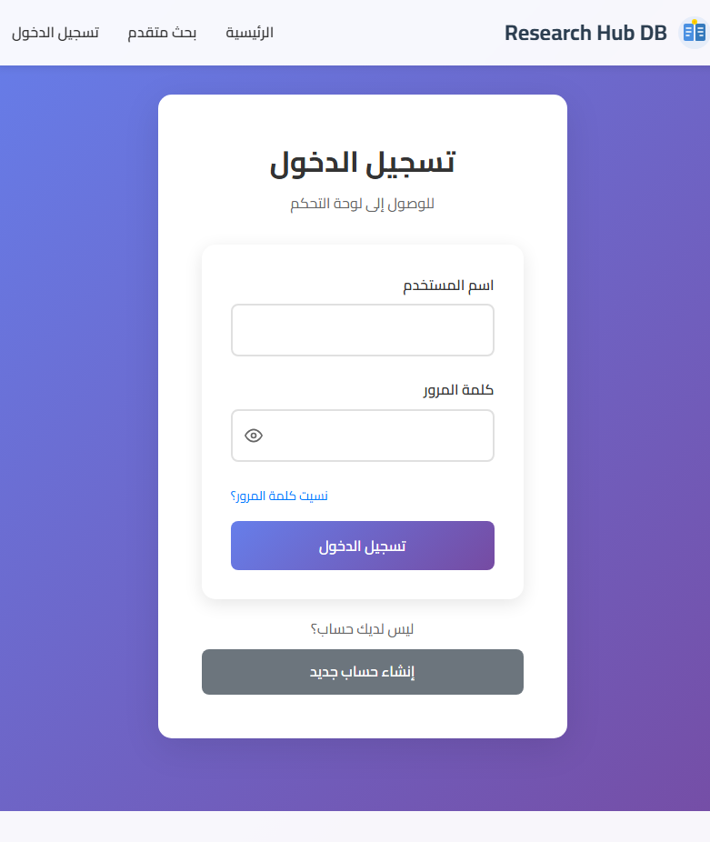
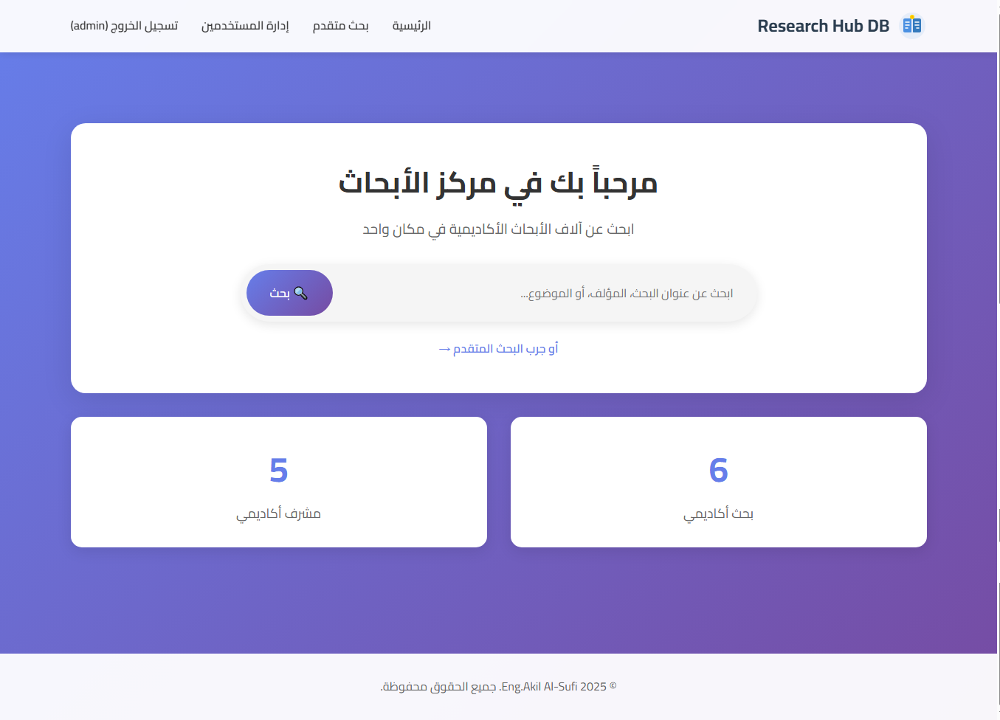

# Research Hub - Flask Application

## 🌟 Project Overview

The **Research Hub** is a robust web application built with **Flask** designed to manage and centralize academic research papers, student projects, and related data within a university or departmental setting. It provides a structured environment for supervisors, department heads, and researchers to track, organize, and access research materials efficiently.

## ✨ Key Features

*   **Role-Based Access Control (RBAC):** Secure login system with distinct roles for Admin, Supervisor, Department Head, and Researcher.
*   **Research Management:** Supervisors can add, edit, and delete research papers, including file uploads and metadata management.
*   **Advanced Search:** Comprehensive search functionality to filter research papers by title, author, topic, and department.
*   **Dashboard Analytics:** Department Heads and Supervisors have dedicated dashboards to view statistics, such as paper count per supervisor and top research topics.
*   **Database Integration:** Uses **MySQL** for persistent data storage, ensuring data integrity and scalability.

## 🛠️ Technology Stack

| Component | Technology | Description |
| :--- | :--- | :--- |
| **Backend Framework** | Flask | Python micro-framework for the application logic and routing. |
| **Database** | MySQL | Relational database for storing all application data. |
| **Frontend** | HTML5, CSS3, JavaScript | Standard web technologies for the user interface. |
| **Styling** | Custom CSS | Custom styling for a clean and professional look. |

## 🚀 Getting Started

### Prerequisites

Before running the application, ensure you have the following installed:

*   Python 3.x
*   MySQL Server (e.g., XAMPP, MAMP, or a standalone installation)

### Installation

1.  **Clone the repository:**
    ```bash
    git clone [REPOSITORY_URL]
    cd research-hub-flask
    ```

2.  **Create a virtual environment and install dependencies:**
    ```bash
    python3 -m venv venv
    source venv/bin/activate  # On Windows use `venv\Scripts\activate`
    pip install -r requirements.txt
    ```

3.  **Database Setup:**
    *   Create a new MySQL database named `research_hub_db`.
    *   Run the SQL script to set up the tables and initial data:
        ```bash
        # Execute the following command in your MySQL client (e.g., phpMyAdmin, MySQL Workbench, or command line)
        SOURCE static/scripts/complete_database_setup.sql;
        ```

4.  **Configure Database Connection:**
    *   Open `app.py` and update the `DB_CONFIG` dictionary with your MySQL credentials (if different from the default `root` user with no password).

5.  **Create First Admin User:**
    *   Run the script to create the default Admin user:
        ```bash
        python3 create_first_admin.py
        ```
    *   The default credentials are: **Username: `admin`**, **Password: `admin123`**.

6.  **Run the Application:**
    ```bash
    python3 app.py
    ```
    The application will be accessible at `http://127.0.0.1:5000`.

## 📸 Screenshots

### Login Page



### Home Dashboard (Example)



## 👤 Developer

This project was developed and is maintained by:

*   **Eng. Akil Alsufi**
    *   GitHub: [https://github.com/Eng-Akil-Alsufi](https://github.com/Eng-Akil-Alsufi)

## 🤝 Contributing

As the sole developer, all contributions and maintenance are currently handled by Eng. Akil Alsufi.

---
